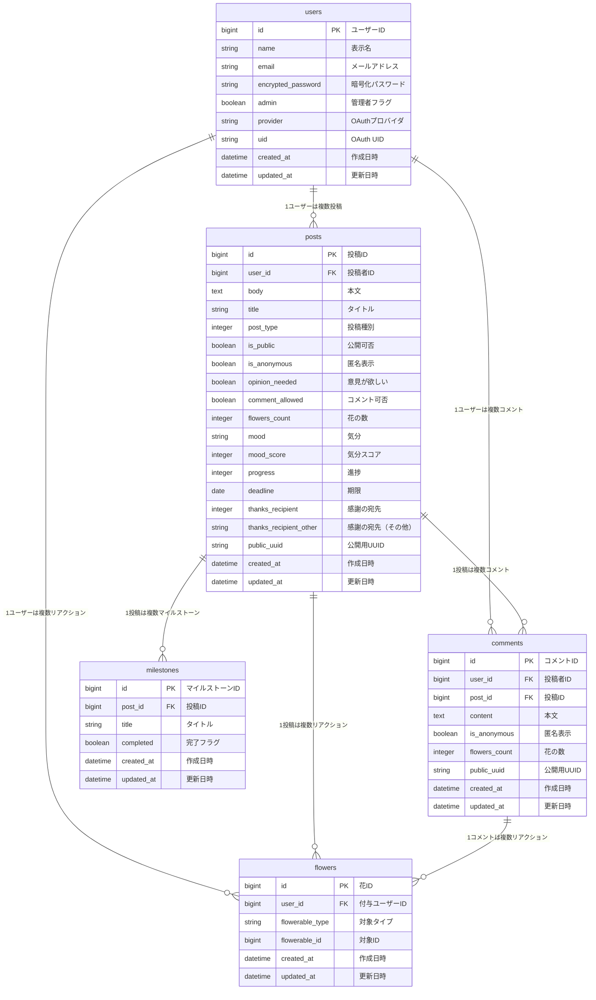

# cocopos（ココポス）- 心のポスト

匿名で「宣言する・書き出す・感謝する」を安心して投稿できる、心の目安箱サービスです。  
投稿は 3つの箱（🌱未来宣言箱 / 🌈心の整理箱 / 💌感謝箱）に仕分けされ、投稿者自身が編集・削除できる体験を提供します。

## ジャーナリング（Journaling）について

### ジャーナリングとは

**ジャーナリング**とは、自分の思考や感情をそのまま書き出す心理的な手法です。  
日記のように出来事を記録することが目的ではなく、頭の中にある考えや感情を言葉にして外に出すことで、内面を整理し理解を深めることを目的としています。

書き方に決まった形式や正解はなく、文章が整っていなくても問題ありません。  
思いついたことをそのまま書く行為そのものが、心理的なリフレクション（内省）として機能します。

この手法は「**書く瞑想**」とも呼ばれ、メンタルケアやセルフケアの一環として活用されています。

---

### ジャーナリングの目的

ジャーナリングには、次のような目的があります。

- 思考や感情を言語化し、頭の中を整理する  
- 感情を客観的に捉え、自分自身を理解する  
- ストレスや不安を抱え込まず、外に出す  
- 自分の気持ちや価値観の変化に気づく  

---

### 期待される効果

心理学的な研究や実践の中で、ジャーナリングには以下のような効果があるとされています。

- **ストレスや不安の軽減**  
  感情を書き出すことで、頭の中のモヤモヤが整理され、心理的負荷が和らぐとされています。

- **自己理解の深化**  
  思考や感情を振り返ることで、自分の考え方の傾向や感情の動きに気づきやすくなります。

- **感情の調整・安定**  
  感情を言葉にして認識することで、気持ちに振り回されにくくなる効果が期待されています。

- **幸福感や満足感の向上**  
  感謝や前向きな出来事を書き留めるジャーナリングは、ポジティブな感情の持続につながるとされています。

---

### 日記との違い

一般的な日記は「何が起きたか」を記録することが中心ですが、  
ジャーナリングは「**そのとき何を感じ、何を考えたか**」という内面のプロセスに焦点を当てます。

出来事そのものよりも、自分の心の動きを言語化する点が大きな違いです。

---

### cocopos とジャーナリング

cocopos は、ジャーナリングの考え方をベースに、  
「未来宣言」「心の整理」「感謝」といったテーマごとに、気持ちを書き残せるサービスです。

自分の内面を無理なく言葉にし、振り返るための場所として活用できます。

---

### 参考・引用元

- あいせいヘリコ  
  **「ジャーナリングとは？書く瞑想の実践メソッド」**  
  https://www.aisei.co.jp/helico/health/rest-techniques-journaling/

---

## サービス概要

- 「宣言する」「書き出す」「感謝する」を匿名で投稿できます
- 投稿は 3つの箱に仕分けされます
  - 🌱 未来宣言箱：これからやること / 目標 / TODO
  - 🌈 心の整理箱：気持ちの整理（意見が欲しい / 意見不要を選択）
  - 💌 感謝箱：ありがとうの記録（振り返りでポジティブ要素を残す）
- 投稿はログイン後にマイページで編集・削除・振り返りが可能です
- 投稿内容を外部に出さず、シェアは固定文「投稿しました📮 #cocopos」のみ（匿名性維持）
- 未来宣言箱では、投稿時に選択した気分をもとに、日ごとの気分推移を折れ線グラフとして表示し、日単位で振り返ることができます。
- 心の整理箱では、入力した文章をAIが整えるアシスト機能を提供しており、文章を書くことに不慣れな場合でも手軽に投稿できます。
- 投稿ごとに「誰に対する感謝か」を記録・確認でき、振り返りの際に感謝の対象を明確にできます。

---

## このサービスへの思い・作りたい理由

SNSはフォロー、フォロワーの関係性や評価（いいね)に左右されやすく、本音を書きづらい場になりがちです。  
一方で匿名掲示板はカテゴリが弱く、スパムや不適切利用など安全性が担保されにくい課題があります。

また、過去の勤務先にあった「目安箱」は紙での運用や匿名性の低さから活用されにくい状態でした。  
そこで「目安箱」をヒントに、自分に向けた未来・整理・感謝を安全に投函できる“心の目安箱”としてアップデートし、匿名でも安心して使えるサービスを目指しています。

cocopos は **「匿名性」×「投稿者自身による管理」** を重視しています。

既存のTODOアプリ、日記アプリ、感謝記録アプリはそれぞれ人気があり、用途ごとに優れた体験があります。
一方で、目的別にアプリが分かれることで記録が分散し、続けづらくなる課題も感じました。
そこで「宣言・整理・感謝」を 1つにまとめ、日々のアウトプットを無理なく習慣化できる場を作ることで、アウトプットの重要性そのものを広めたいと考え
本サービスの開発に至りました。

---

## 想定ユーザー

- 就職・人間関係などの悩みがあり、SNS を使っていても「見られたくない気持ち」がある人
- 既存 SNS に疲れ、安心して気持ちを整理したい人
- アルゴリズムによる関係ない広告/おすすめ表示を避けたい人

---

## ユーザー体験フロー

1. 会員登録（メール + パスワード）してログイン
2. 投稿箱を選択（未来宣言 / 心の整理 / 感謝）
   - 心の整理箱は「意見が欲しい / 意見不要」を選択（コメント可否に反映）
3. 投稿完了（投函アニメーション + 完了画面）
   - 「投稿一覧へ」「マイページへ」「Xでシェア（固定文のみ）」を提示
4. マイページで投稿を編集・削除・振り返り

---

## ユーザー獲得方法

- X（旧Twitter）での固定メッセージシェア  
  投稿内容は含めず「投稿しました📮 #cocopos」のみを拡散し、匿名性を維持しつつ認知を拡大します。
- 卒業制作ポートフォリオとしての公開  
  制作背景・安心設計・匿名運用の意図を伝え、共感性のあるユーザー層に訴求します。

---

## 差別化ポイント

### 既存 SNS ではない理由
SNSは評価や関係性が前提になりやすく、弱さや本音が出しづらい環境になりがちです。  
cocopos は **匿名 × 投稿者管理 × 安全設計** により、安心して素直な気持ちを投函できる場を目指します。

### 日記アプリではない理由
日記は閉じた整理が中心で、未来宣言や感謝のような「前向きな要素」を同時に残せないことがあります。  
cocopos は 3つの箱に仕切ることで、振り返り時にポジティブ要素も必ず見える設計です。

### AI チャットではない理由
AI は返答が得られても「プログラムの応答」に感じられることがあります。  
cocopos は匿名も可能なコミュニティとして、人との距離感を保ちながら「人の共感」を得られる余地を残します。

### 知恵袋系サービスではない理由
解決策の獲得が目的の場は「ただ書き出したい」「共感してほしい」に向きません。  
cocopos は解決よりも「心の整理として安心して書けること」に価値を置きます。

---

## 機能

### MVP機能

- ユーザー登録 / ログイン（Devise）
- 投稿（未来宣言 / 心の整理箱 / 感謝箱）
- 投稿ごとの匿名表示切替（デフォルト: 匿名さん、任意でユーザー名）
- 心の整理箱：意見が欲しい / 意見不要（コメント可否に反映）
- コメント機能（意見が欲しい投稿のみ）
- 投稿編集・削除（本文のみ / 投稿者本人）
- 投稿完了画面（投函アニメーション + 次アクション導線）
- Google Analytics
- 投稿カレンダー

### 本リリース実装機能（追加済み）

- 投稿検索・絞り込み
- 未来宣言箱：期限日 + 進捗（20%刻み、自己更新）
- 感謝箱：感謝カレンダー反映
- 共感リアクション（いいねではなく花💐）
- レスポンシブ対応
- NG ワードフィルタ（Obscenity）
- 管理者フィルタリング（不適切投稿の削除）
- 利用規約 / プライバシーポリシー / お問い合わせ（Google フォーム）
- パスワード再設定メール
- Google アカウントログイン
- 静的 OGP
- 独自ドメイン設定
- UUID化
- Rspec実装
- CI導入

---

## CI / 品質チェック

Pull Request 作成時に、以下のチェックが GitHub Actions で自動実行されます。

- RSpec（Rails テスト）
- RuboCop（Ruby 静的解析）
- ESLint（JavaScript 静的解析）

すべてのチェックが通過することを前提に開発を進めています。

## 技術スタック

### バックエンド
- Ruby 3.2.9
- Ruby on Rails 7.1.3

### フロントエンド
- JavaScript
- Tailwind CSS
- Hotwire（Turbo / Stimulus）

### 主な Gem / ライブラリ
- Devise（認証）
- Kaminari（ページネーション）
- Ransack（検索）
- Obscenity（NG ワードフィルタ）
- RuboCop（静的解析）
- Stimulus Autocomplete（検索 UI）
- Kaminari（ページネーション）
- OmniAuth Google OAuth2（Google ログイン）
- Resend（メール配信）
- OpenAI（AI 連携）
- MetaTags（メタタグ管理）
- RuboCop (コード整形)
- rubocop-rspec（静的解析）

### インフラ / 開発環境
- Render（MVP 環境）
- Docker

---

## 画面遷移図

- Figma: 画面遷移図  
  https://www.figma.com/design/4VLw1zL1ppcUPlM0KYXrHb/cocopos?node-id=7-136&p=f&t=qjTO90C6uF0yonao-0

---

## ER 図（Mermaid）

